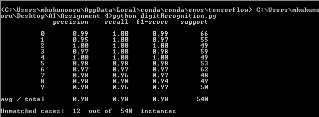
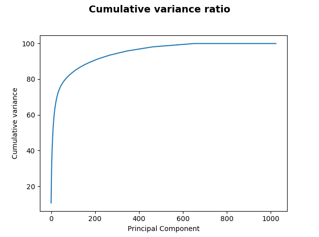
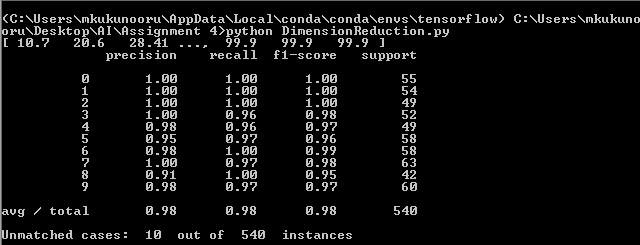

### Handwritten Digit Recognition

* The task of this assignment is to design a pattern recognition neural network to recognize hand written digits given a large dataset of digits in a 32 * 32 Boolean format.

* To construct a machine learning model, the first task is to find the features that determine each digit.
* Looking at the digits, we can say that each individual digit can be seen as a pixel each of which contributes to the final result that comes out of the model.  

So the 32 by 32 pixel format is transformed into 1024 by 1 vector where each of the pixel represents each feature of a particular instance of digit. And we were already given the class of each instance i.e., the original digit given in the dataset. The dataset was divided into test and train with a test size of 30% of entire data. Neural network is used as the model as we were told to use the classifier. I have used sklearn library as it is the standard library for machine learning.

When the hidden nodes in the neural network are considered to be 1000. The confusion matrix is as follows:

Considering 1024 features for every instance, and a specific number of hidden nodes, we got the results as above. We can observe that as the nodes in the hidden layer increases from 10 – 100, the precision raised from 89% to 97%. This shows us how important choosing the number of nodes is. But another interesting point that you can observe is that, when the hidden nodes increased from 100 to 1000, precision is almost the same except the 1% increase. This is because, after some point, the learning of the model becomes stagnant, irrespective of the number of hidden nodes etc., Then we have to find other ways such as scaling, removing outliers etc., to increase the accuracy rather than keep on changing the number of nodes.

Then we were asked to reduce the number of features from 1024 as running a neural network with 1024 features is a lot to ask for. This is called dimensionality reduction in machine learning terms. There are a lot of methods to perform this task. Here I am using one of them called Principal Component Analysis (PCA) which transforms the features into other axes where the variance is highest. First, I considered the 1024 components and tried to apply PCA on it. I obtained a covariance matrix which cumulatively add up to 100 which represents the range of values of each pixel.

Using 1000 nodes in hidden layer, the confusion matrix is as follows:

We can see that the results doesn’t change much but for the case of 10 hidden nodes the accuracy changes by a large value. But we’ve reduced the components by half the number and same with the computations. By performing the dimension reduction we consider only those components which have a significant effect on classification. 
